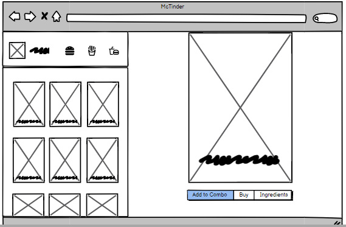
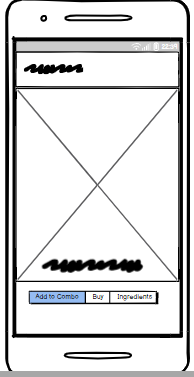

# McTinder

---

## Table of Contents

- [Updates](#updates)
- [Project Steps](#project-steps)
  - [Wireframe](#wireframes)
    - [Desktop](#desktop)
    - [Mobile](#mobile)
  - [Layout](#layout)
    - [Properties](#properties)
      - [Mobile](#mobile-1)
      - [Desktop](#desktop-1)

---

## Updates

- update-1.2.0

> I added a table with all properties of the project layout.
>
> I added medias, such as svg and png files.
>
> I added an up button on the end of the Readme.md

- update-1.1.2

> ReadeMe debugged
> lunch.jason added for accident but it's empty

- update-1.1.1

> Set #desktop and #mobile correctly

- update-1.1.0

> Added a layout folder with desktop and mobile wireframe to the project.
> Added #wireframes, #desktop, and #mobile section.

- update-1.0.5

> Set the #project-steps correctly

- update-1.0.4

> Set the #ProjectSteps correctly

- update-1.0.3

> Set the #ProjectSteps correctly

- update-1.0.2

> Set the #ProjectSteps correctly

- update-1.0.1

> Set the #ProjectSteps correctly

- update-1

> Adding the project steps.

---

## Project Steps

- Wireframing;
- Make the layout;
  - Units;
  - Typography;
  - Colorscheme;
- Make a prototype;
- Code HTML;
- Code CSS;

---

### Wireframes

#### Desktop

#### Mobile

---

### Layout

#### Properties

##### Desktop

|  Section          | Width (px)(%)|Height (px)(%)| Color   |
|-------------------|--------------|--------------|---------|
| Screen            | 1326px -100% | 619px - 100% | #D9D9D9
| Header            | 397.8px - 30%| 123.8px - 20% | #DA291C
| Logo              | 69.64px - 5.25% | 55.71px - 9%|#FFC72C
| Burger Icon       | 55.24px - 4.17% | 55.71px - 9% |-
| French Fries Icon | 41.73px - 3.15% | 55.71px - 9% |-
| Soda Icon         | 18.57px - 1.4% | 55.71px - 9% |-
| Left column       | 397.8px - 29.95% | 495.2px - 80% |#FFC72C
| Photos-Grid       | 104.42px - 7.87% | 123.8px - 20% | #D9D9D9
| Right column      | 928.2px - 70% | 619px - 100% |#27251F
| Photos            | 417.69px - 80% | 495.2px - 80% | #D9D9D9
| Buttons           | 54px - 4.07% | 54px - 8.72 | #FFC72C

 

 

##### Mobile

| Section | Width (px)(%)    | Height (px)(%) | Color   |
| ------- | ---------------- | -------------- | ------- |
| Screen  | 320px - 100%     | 619px - 100%   | #D9D9D9
| Header  | 320px - 100%     | 124 - 20.03%   | #DA291C |
| Logo    | 69.64 - 21.76    | 55.71 - 9%     | #FFC72C |
| Main    | 320px - 100%     | 495px - 79.97% | #FFC72C |
| Photos  | 271.5px - 84.84% | 321.88 - 52%   | #D9D9D9 |
| Buttons | 35.1px  - 10.97% | 35.1px - 5.67% | #FFC72C |

## [⬆️](#table-of-contents)

---